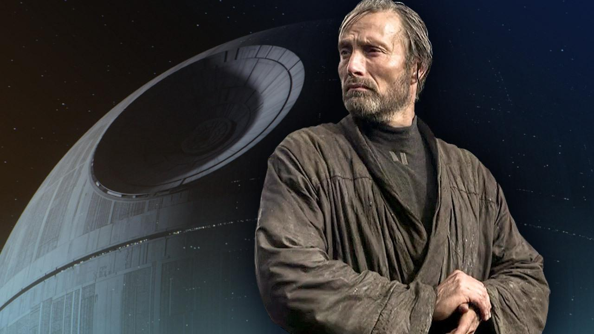

<h1>Histroria rogue one</h1>

Un dia Galen Erso es obligado por el imperio a ayudar a construir el arma más poderosa de la galaxia: la Estrella de la Muerte.

Cuando la alianza rebelde se entera que Galen dejo un mensaje oculto, reclutan a su hija Jyn juanto con Cassian para robar los planos.

Cuando el imperio se entera del grupo que intenta robar los planos va en busca de ellos para detenerlos.

Jyn y Cassian logran escapar del imperio para luego dirigirse al planeta Scarif.

Pero para llegar a Scarif, antes Jyn y Casian llegan a la base rebelde en donde piden permiso pero se les niega.

