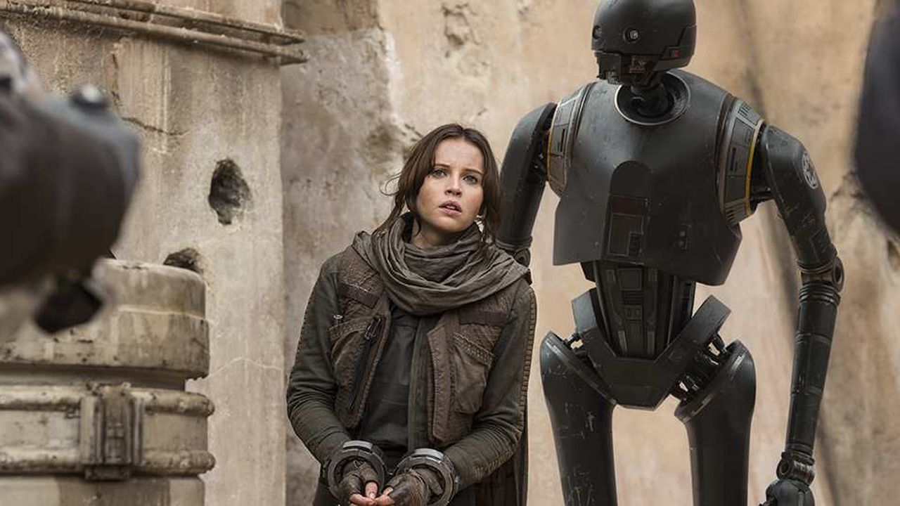
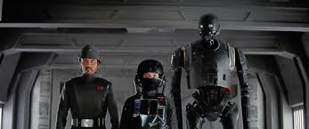

<h1>Histroria rogue one</h1>

Un dia Galen Erso es obligado por el imperio a ayudar a construir el arma más poderosa de la galaxia: la Estrella de la Muerte.

Cuando la alianza rebelde se entera que Galen dejo un mensaje oculto, reclutan a su hija Jyn juanto con Cassian para robar los planos.

Cuando el imperio se entera del grupo que intenta robar los planos va en busca de ellos para detenerlos.

Jyn y Cassian logran escapar del imperio para luego dirigirse al planeta Scarif.

Pero para llegar a Scarif, antes Jyn y Casian llegan a la base rebelde en donde piden permiso pero se les niega.

Así que deciden ir sin permiso y así adentrarse en el planeta Scarif e infiltrarse en la base del imperio para buscar los planos de la estrella de la muerte

Despues de una larga batalla finalmente logran rorbar los planos de la estrella de la muerte y enviarlos a la base rebelde donde los reciben con exito para luego enviarselos a la princesa Leia. Aunque esto supone la muerte de Jay y Casian con la destruccion del planeta.

